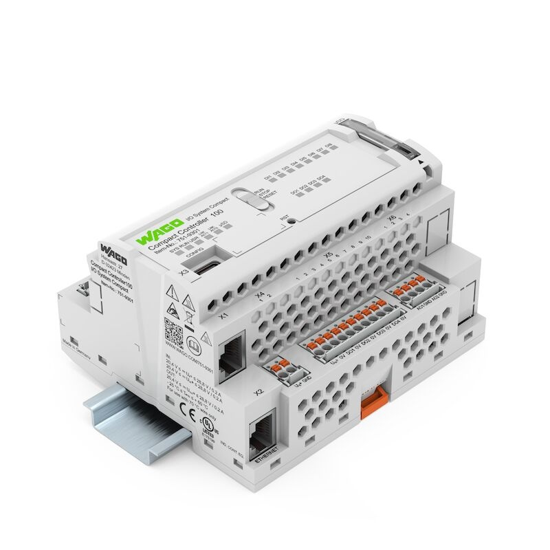

# How to install:
WAGO recommends the exclusive use of original WAGO SD cards, since the new firmware has been tested and released on the basis of these cards. If cards other than those recommended by WAGO are used, WAGO cannot assume any warranty or responsibility for problems that occur during the installation of the PLC.
## Installation
1.	Delete full content of the card with tools like [SD-Card Formatter](https://www.sdcard.org/downloads/formatter).
2.	Write image on the WAGO SD card with [Balena Etcher](https://www.balena.io/etcher).
3.	Plug-in the WAGO SD card first before booting the CC100.
4.	Connect a USB-C cable between PC and CC100. This is needed since a factory-image PLC is set to use DHCP and therefore has no fixed IP address.
5.	Adjust the static IP address with "Wago Ethernet Settings". (WAGO Ethernet settings must be version 6.15.5.0 or newer)
6.	Due to changes in the Web Based Management (WBM), make sure that the entire browser cache (!) is cleared and the browser is then restarted.
7.	Open "Web Based Management / Administrations – Menu / Create Image // Create bootable image from active partition (SD) // Start Copy".
